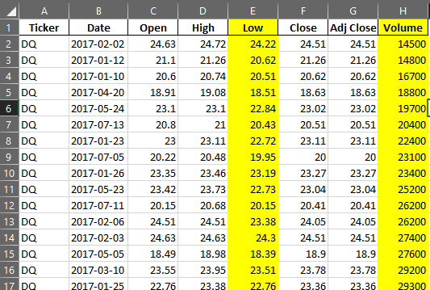

# Stock Analysis with Excel

## Overview of Module 2 Challenge

### Purpose

The Purpose of the exercise "Stock Analysis with Excel" is to create to create a worksheet with research by Years of stocks to allow the users to be able to add additional new or historic years in sheets for analysis of their stock performances.

See macro spreadsheet  [VBA_Challenge.xlsm](VBA_Challenge.xlsm) 

## Results and Challenges

The Results of the original design looped through the total number of rows and looped through the 12 stocks that were provided.

Time it took to run through the code for 2017:

|                                                              |                                                              |
| ------------------------------------------------------------ | ------------------------------------------------------------ |
|  |  |

Time it took to run through the code for 2018:

|                                                              |                                                              |
| ------------------------------------------------------------ | ------------------------------------------------------------ |
|  |  |

Noticing that the performance is approximately 1.3 seconds for 3000 rows for which it takes approximately 0.0004 second to process each line in the outside loop for which there is an additional inside loop that loops 12 counts for the 12 tickers.

Since the data is sorted in alphabetical order under the first column (Ticker) as well as our array in the VBA code is sorted in alphabetical order. We can then traverse the worksheet table by "peeking ahead" and checking to make sure the next row is the same or a new ticker to populate our totals. By eliminating the second for loop to iterate over the Ticker, and using a variable to set the current Ticker array position, we can refactor the code to loop once and produce the same results faster.

Time it took to run through the refactored code for  2017:

|                                                              |                                                              |
| ------------------------------------------------------------ | ------------------------------------------------------------ |
|  |  |

Time it took to run through the refactored code for 2018:

|                                                              |                                                              |
| ------------------------------------------------------------ | ------------------------------------------------------------ |
|  |  |

## Summary 

The advantages of refactoring is that it can speed up the time & efficiency to process data, the refactored code iterates through the table once (For Loop) with an if condition looking up one row and another looking down one row to establish a starting price and ending price + iterating the tickerIndex up one integer to access the next Ticker value in the array. 

Comparably, there is no advantage that I can see of the original code vs the refactored code as the original code relies on the data being sorted in order by Ticker and Date just like the refactored code. The original code is slower by a factor of 5. Assuming each record takes 12 more cycles because of the second For Loop, the refactored code takes 2.5 cycles (due to an initial smaller loop to reset tickerVolumes(i) values to 0, and additional array definitions and usage, and tickerIndex incrementation)

This brings up the disadvantage of both codes is that it relies entirely that the table be ascending order by Ticker and then Date as well as specific set datatypes and values are accurate and valid, i.e. starting price cannot be $0 or else the results show a Return that is Empty (see first row of Return below)

#### Further refactoring (for the case of the out of order sheets)

If the table was out of order (worst case scenario outside of invalid datatypes under the columns, we would find that the original code and the current refactored code could be used to be the starting code to develop code could be the basis to process an out of order table as it would loop on Ticker in the sheet as well as Ticker array in the code (this would allow us to sort the Ticker code by preferred instead of alphabetical order in the code) with all values for tickerVolume(j), (tickerEndingPrices(j), tickerStartingPrices(j), an introducing two arrays to store tickerStartingDate(i) and tickerEndingDate(j) to store the min and max date to match the tickerEndingPrices and tickerStartingPrices, i.e.

    Sub yearValueAnalysisUnordered()
    
        Dim startTime As Single
        Dim endTime  As Single
    
    'prompt InputBox
        yearValue = InputBox("What year would you like to run the analysis on?")
        
    'start time
        startTime = Timer
    
    '1 Format the output sheet on the "All Stocks Analysis" worksheet.
        Worksheets("All Stocks Analysis").Activate
        Range("A1").Value = "All Stocks (" + yearValue + ")"
        
        'Create a header row
        Cells(3, 1).Value = "Ticker"
        Cells(3, 2).Value = "Total Daily Volume"
        Cells(3, 3).Value = "Return"
        
    '2 Initialize an array of all tickers.
        Dim tickers(12) As String
        tickers(0) = "AY"
        tickers(1) = "CSIQ"
        tickers(2) = "DQ"
        tickers(3) = "ENPH"
        tickers(4) = "FSLR"
        tickers(5) = "HASI"
        tickers(6) = "JKS"
        tickers(7) = "RUN"
        tickers(8) = "SEDG"
        tickers(9) = "SPWR"
        tickers(10) = "TERP"
        tickers(11) = "VSLR"
    
    '3 Prepare for the analysis of tickers.
    '3a Initialize variables for the starting and ending price and dates and Volumes.
        Dim tickerStartingPrices(12) As Long
        Dim tickerEndingPrices(12) As Long
        Dim tickerStartingDate(12) As Date
        Dim tickerEndingDate(12) As Date
        Dim tickerVolumes(12) As Long
        For i = 0 To 11
            tickerStartingPrices(i) = 0#
            tickerEndingPrices(i) = 0#
            tickerStartingDate(i) = DateValue("Jan 01, 1999")
            tickerEndingDate(i) = DateValue("Jan 01, 1999")
            tickerVolumes(i) = 0#
        Next i
    '3b Activate the data worksheet.
        Worksheets(yearValue).Activate
        
    '3c Find the number of rows to loop over.
        rowStart = 2
        'rowEnd code taken from https://stackoverflow.com/questions/18088729/row-count-where-data-exists
        rowEnd = Cells(Rows.Count, "A").End(xlUp).Row
        
    '4 Loop through the tickers.
        For i = 0 To 11
         
            ticker = tickers(i)
        
    '5 Loop through rows in the data.
            Worksheets(yearValue).Activate
            For j = rowStart To rowEnd
    '5a Find the total volume for the current ticker.
                If Cells(j, 1).Value = ticker Then
                    tickerVolumes(i) = tickerVolumes(i) + Cells(j, 8).Value
                    
                    If Cells(j, 2).Value < tickerStartingDate(i) Or tickerStartingDate(i) = DateValue("Jan 01, 1999") Then
    
                        tickerStartingPrices(i) = Cells(j, 6).Value
                        tickerStartingDate(i) = Cells(j, 2).Value
    
                    End If
                    If Cells(j, 2).Value > tickerEndingDate(i) Or tickerEndingDate(i) = DateValue("Jan 01, 1999") Then
    
                        tickerEndingPrices(i) = Cells(j, 6).Value
                        tickerEndingDate(i) = Cells(j, 2).Value
    
                    End If
                End If
            Next j
    
    '6 Output the data for the current ticker.
            ' MsgBox (totalVolume)
        Next i
        For i = 0 To 11
            
            Worksheets("All Stocks Analysis").Activate
            Cells(4 + i, 1).Value = tickers(i)
            Cells(4 + i, 2).Value = tickerVolumes(i)
            Cells(4 + i, 3).Value = (tickerEndingPrices(i) / tickerStartingPrices(i)) - 1
            
        Next i
    'Formatting
        Worksheets("All Stocks Analysis").Activate
        Range("A3:C3").Font.FontStyle = "Bold"
        Range("A3:C3").Borders(xlEdgeBottom).LineStyle = xlContinuous
        Range("B4:B15").NumberFormat = "#,##0"
        Range("C4:C15").NumberFormat = "0.0%"
        Columns("B").AutoFit
    
        dataRowStart = 4
        dataRowEnd = 15
    
        For i = dataRowStart To dataRowEnd
            
            If Cells(i, 3) > 0 Then
                
                Cells(i, 3).Interior.Color = vbGreen
                
            Else
            
                Cells(i, 3).Interior.Color = vbRed
                
            End If
            
        Next i
    ' End Time
    endTime = Timer
    MsgBox "This code ran in " & (endTime - startTime) & " seconds for the year " & (yearValue)
    
    End Sub
Performance of the refactored original code to handle unsorted data:

|                                                              |                                                              |
| ------------------------------------------------------------ | ------------------------------------------------------------ |
|  |  |
|  |  |

Quite interestingly, this code is faster than the Original code but twice as slower than the refactored code, due to Nesting If conditions to allow If conditions to execute when needed compared to the original code. When the 2017 data sorted by Volume and then the Low column and the 2018 data sorted by Ticker and Date did not see a huge difference in performance since the number of loop iterations (2) are the same. In review, it appears the If Then Else conditions perhaps have a far greater time penalty than For loops and utilizing arrays are quite valuable.

 

### Conclusion

Refactoring code generally is a positive and worthwhile change to code when it speeds up processing and reduce system loads especially if it can take in account data quality or sorting issues if and when those are factors in the data.